# Google Calendar Desktop Widget

**Your Google Calendar, living on your desktop.**
Transparent. Click-through. Always up to date. Never in the way.

🌐 **[Website](https://mkazemie.github.io/google-calendar-desktop-widget/)** · 📥 **[Download](https://github.com/mkazemie/google-calendar-desktop-widget/releases/download/v1.1.0/CalendarWidgetSetup-1.1.0.exe)**

## Your schedule, always one glance away

Stop alt-tabbing to check what's next. Google Calendar Desktop Widget pins the **real Google Calendar** straight onto your desktop wallpaper — softly transparent, pinned beneath all your windows, and completely invisible to your mouse. You click, drag, and work right *through* it, like it's part of the background.

And because it's the live Google Calendar — not a copy — **it updates in real time**. Add an event from your phone, accept an invite on your laptop, and watch it appear on your desktop seconds later.

## ✨ Why you'll love it

- 🪟 **Truly click-through** — clicks, drags, even *right-clicks* land on whatever is behind it: desktop icons, files, the wallpaper menu. Zero interference.
- 🔄 **Live, not a snapshot** — it *is* Google Calendar, synced across all your devices in real time.
- ✏️ **Edit in place** — one click on the title bar makes it a normal window: add events, drag meetings around, then toggle back.
- 👻 **As subtle as you want** — transparency from 0 to 95 %, so it melts into your wallpaper.
- 📌 **Stays in the background** — pinned to the bottom; it never pops over your work, never steals focus, never interrupts a game of full-screen video.
- 🖥️ **Feels native** — snap it, maximize it, drag it between monitors like any Windows 11 app.
- 🚀 **Set and forget** — starts with Windows, sits quietly in the tray, remembers your sign-in.

## 🖱️ One button, two modes

The mouse button in the top-right corner **stays clickable even in widget mode** — flipping back to a full, editable calendar is always exactly one click away.

## 👆 Yes — even right-click goes through

The widget is completely invisible to your mouse. Right-click your wallpaper and Windows answers, not the calendar — the desktop context menu opens straight through it, exactly as if the calendar weren't there.

## 🎛️ A tiny control panel runs everything

Transparency, hover-panel corner, start-with-Windows, sign-out — all in one small panel. Drag the slider and watch the calendar melt into your wallpaper in real time.

## 📥 Get it

1. **[Download the latest installer](https://github.com/mkazemie/google-calendar-desktop-widget/releases/download/v1.1.0/CalendarWidgetSetup-1.1.0.exe)** (≈ 2 MB) and run it — it fetches anything else it needs automatically.
2. **Sign in** to your Google account on first launch.
3. Hit the **mouse button** in the title bar — your calendar fades into the desktop. Done.

> Works on Windows 11 and Windows 10. Free forever.

## ❤️ Support the project

Calendar Widget is free and always will be. If it earns a permanent spot on your desktop, you can fuel its development:

**[☕ Donate via PayPal](https://paypal.me/MahdiKazemiesfahani)**

## License

Licensed under the [Apache License 2.0](LICENSE).

*This is an unofficial, independent project — not affiliated with or endorsed by Google. Google Calendar is a trademark of Google LLC.*
